# Архитектура

Как устроен «Жэка Коммуналкин»: из чего состоит, как части связаны и какие свойства держит сервер. Что делает продукт - в [product.md](product.md), откуда данные - в [data.md](data.md), запуск и проверка - в [README](../README.md)

Легенда диаграмм: сплошная линия - основной путь, пунктир - необязательная связь, фолбэк, подмена или разовая операция; синим - наша система, серым - внешняя реальная система, оранжевым - мок, заглушка, демо-режим или фолбэк

## Системный контекст

Решение живет внутри MAX: житель и сотрудник УК открывают мини-приложение из
клиента MAX, исполнитель работает только в боте, бот пишет в личные сообщения
и домовые чаты. Обязателен только MAX. Сервисы Yandex, подложки карты и
геокодер необязательны: без каждого есть фолбэк. ГИС ЖКХ и Реформа ЖКХ в
рантайме не вызываются - их данные собраны в сид заранее

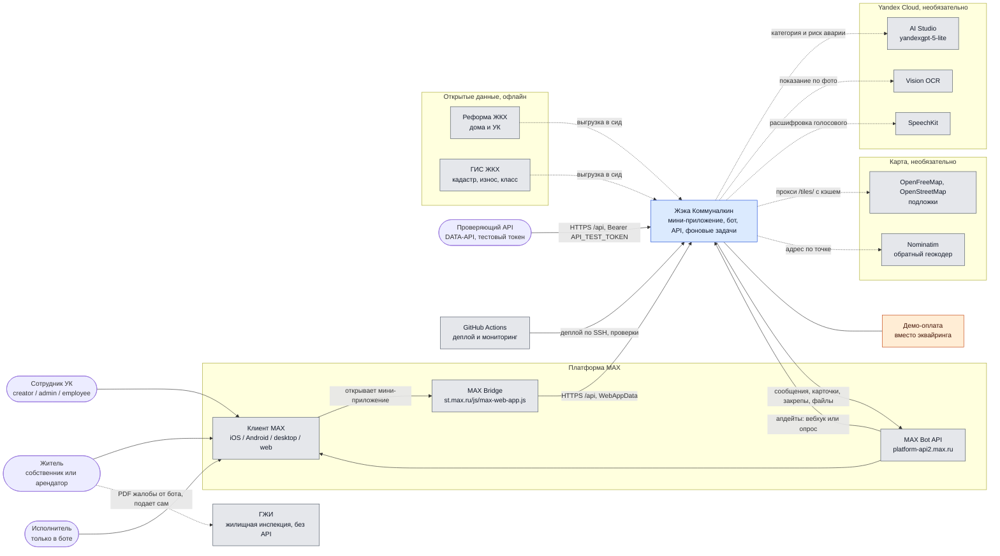

PlantUML: [`01-context.puml`](architecture/plantuml/01-context.puml)

## Компоненты

Все локальные компоненты поднимает `docker compose up`. Наружу опубликован
только порт nginx. `migrations` собирает образ `zheka:local`, а `api` и
`worker` берут его же (`pull_policy: never`) и отличаются только командой.
TLS в репозитории не настроен: на проде его снимает nginx хоста перед compose

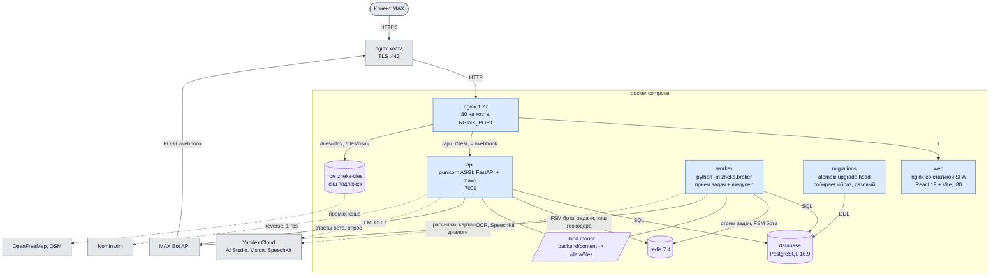

PlantUML: [`02-containers.puml`](architecture/plantuml/02-containers.puml)

- `api` - один процесс gunicorn с ASGI-воркером: REST для мини-приложения и бот на maxo. В проде бот получает апдейты через вебхук (`MAX_BOT_MODE=webhook`), локально - опросом
- `worker` - `python -m zheka.broker`: фоновые задачи taskiq и их расписание в одном процессе. Рассылки, карточки в домовых чатах, напоминания, контроль сроков, автозакрытие, уборка
- `web` - мини-приложение, собранное в статику
- `migrations` - прогоняет alembic и завершается; `api` и `worker` стартуют после него
- `nginx` - единственная точка входа. TLS снимает хост: MAX принимает вебхук только на 443 с настоящим сертификатом

Порядок старта задают `depends_on`: `database` и `redis` проходят healthcheck,
один раз отрабатывает `migrations`, затем стартуют `api` и `worker`, nginx
ждет здорового `api`

| Контейнер | Что делает | Порт | Хранилища |
|-----------|-----------|------|-----------|
| `nginx` | Единая точка входа, разводит пути, кэширует подложки карты | 80 на хосте | том `zheka-tiles` |
| `web` | Собранный SPA, SPA-фолбэк, кэш `/assets/` | 80 в сети compose | - |
| `api` | REST мини-приложения и кабинета УК, бот на maxo в том же процессе | 7001 в сети compose | Postgres, Redis, файлы |
| `worker` | Прием задач taskiq и шедулер в одном процессе | - | Postgres, Redis, файлы |
| `migrations` | Собирает образ бэкенда, применяет alembic и завершается | - | Postgres |
| `database` | Данные домена, события аналитики, ключи идемпотентности | 5432 в сети compose | том `zheka-postgres` |
| `redis` | FSM и диалоги бота, очередь и расписание taskiq, кэш и слот Nominatim | 6379 в сети compose | том `zheka-redis` |

## Внешние сервисы

Обязателен только MAX, остальные сервисы необязательны: без каждого есть фолбэк. Подсказка категории и OCR - синхронные вызовы из API с таймаутом 3 секунды, SpeechKit работает из фоновой задачи бота. ГИС ЖКХ сервис не вызывает: паспорт дома собран заранее, при сборе демо-данных

| Внешняя система | Кто и как ходит | Настройка | Без нее или вместо нее |
|-----------------|-----------------|-----------|------------------------|
| MAX Bot API `platform-api2.max.ru` | `api` отвечает на апдейты, `worker` шлет уведомления, карточки в чатах, закрепы, диалоги, качает файлы из сообщений | `MAX_TOKEN` | не работает ничего, в Docker не воспроизвести |
| MAX вебхук (входящий) | MAX шлет апдейты на `/webhook`, секрет в `X-Max-Bot-Api-Secret`; `keep_webhook` каждые 10 минут перерегистрирует потерянный | `MAX_BOT_MODE`, `MAX_WEBHOOK_URL`, `MAX_SECRET_TOKEN` | локально `polling`, домен и сертификат не нужны |
| MAX Bridge | фронт читает `window.WebApp`: `initData`, `BackButton`, `HapticFeedback`, `openCodeReader` (QR квитанции), `requestContact` (телефон), подтверждение закрытия | - | dev-сборка вне MAX шлет `WebAppData: dev`, прод-сборка показывает `outside-max` |
| Подпись `initData` | `current_user` проверяет HMAC заголовка `WebAppData` на токене бота | `MAX_TOKEN` | тестовый токен `API_TEST_TOKEN` в `Authorization: Bearer` для проверки без MAX |
| Yandex AI Studio | `POST /api/requests/classify`, синхронно, 3 с, текст проходит `mask_pii` | `YANDEX_API_KEY`, `YANDEX_FOLDER_ID`, `YANDEX_MODEL` | категория кнопками, опасные фразы ловят правила `core/danger` |
| Yandex Vision OCR | `POST /api/meters/readings/recognize` синхронно, 3 с; фото счетчика в боте - задача `recognize_meter_photo` | `YANDEX_API_KEY`, `YANDEX_FOLDER_ID` | житель вводит число сам |
| Yandex SpeechKit | задача `transcribe_voice`, только если MAX не прислал свою расшифровку, 10 с | `YANDEX_API_KEY`, `YANDEX_FOLDER_ID` | бот просит написать текстом |
| Квота Yandex | 60 вызовов в час на пользователя на все три сервиса, в памяти процесса | - | ответ как без ключей |
| OpenFreeMap, OSM | подложки MapLibre через кэширующий прокси nginx `/tiles/` | - | карта не грузится, дом выбирается списком |
| Nominatim | `GET /api/houses/at`: адрес здания по тапу, 1 rps на приложение, кэш в Redis 30 дней | - | тап вне справочника не дает адреса |
| Реформа ЖКХ, ГИС ЖКХ | не вызываются: паспорт дома и УК собраны в `seed/data/*.csv` заранее | - | - |
| Эквайринг | не делаем | - | `POST /api/charges/{id}/pay` только ставит `paid_at` |
| Биллинг УК | не делаем, точка интеграции - таблица `charges` | - | модельные начисления за полгода в демо-УК |
| ГЖИ | API нет: `POST /api/requests/{id}/gji-pdf` ставит задачу, бот присылает PDF жалобы | - | житель подает сам |
| GitHub Actions | `deploy.yml` по SSH, `uptime.yml` проверяет стенд и пишет капитану в MAX | секреты репозитория | ручной `deploy.sh` на VPS |
| Фронт без бэкенда | `pnpm mock` поднимает `mock-config-server` на `:31299` с базой `/api` | `DEV_API_TARGET=http://localhost:31299` | состояние в памяти мок-сервера |

На стенде ключей Yandex нет, поэтому там все три сервиса Yandex работают в
режиме фолбэка

### Подсказка категории заявки (LLM)

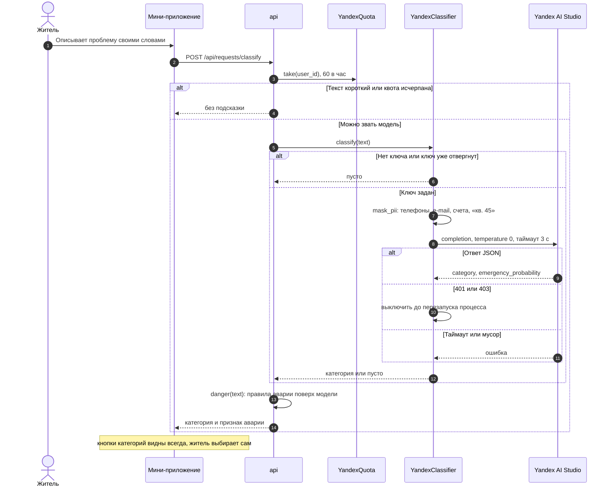

PlantUML: [`11-seq-classify.puml`](architecture/plantuml/11-seq-classify.puml)

### Показание счетчика по фото (OCR)

Два входа: форма мини-приложения (синхронно) и фото в диалог с ботом
(фоновая задача). Любой сбой сводится к пустому полю

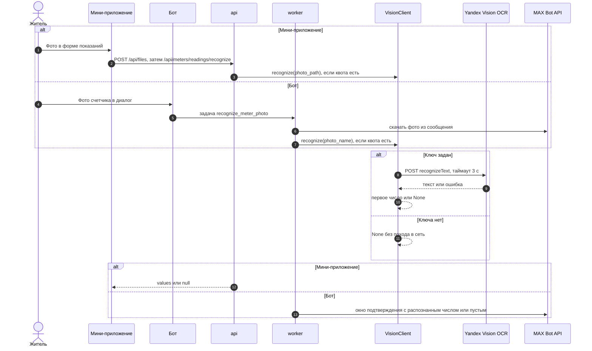

PlantUML: [`12-seq-ocr.puml`](architecture/plantuml/12-seq-ocr.puml)

### Голосовое в боте (SpeechKit)

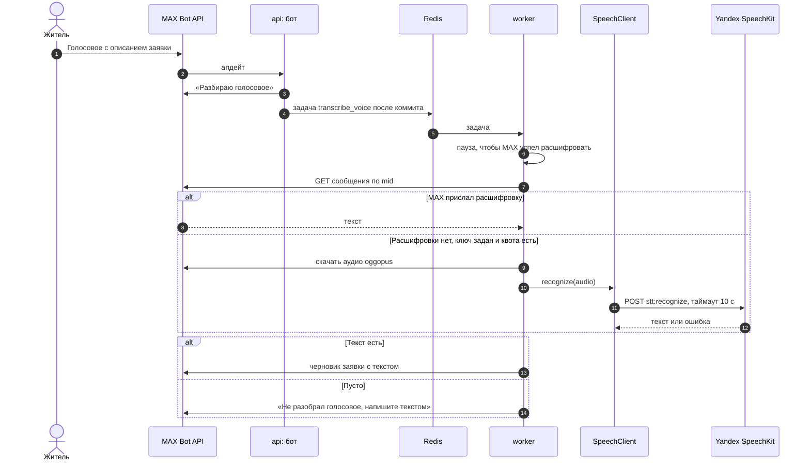

PlantUML: [`13-seq-voice.puml`](architecture/plantuml/13-seq-voice.puml)

### Карта: подложки и геокодер

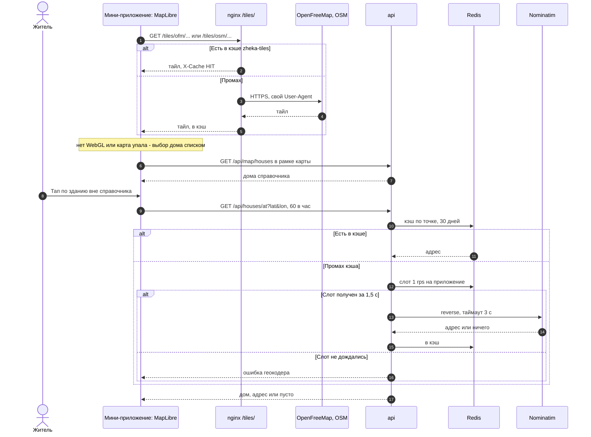

PlantUML: [`15-seq-map.puml`](architecture/plantuml/15-seq-map.puml)

### Демо-оплата квитанции

Реальной оплаты нет: ручка имитирует успех эквайринга, чтобы сценарий
квитанции проходился до конца

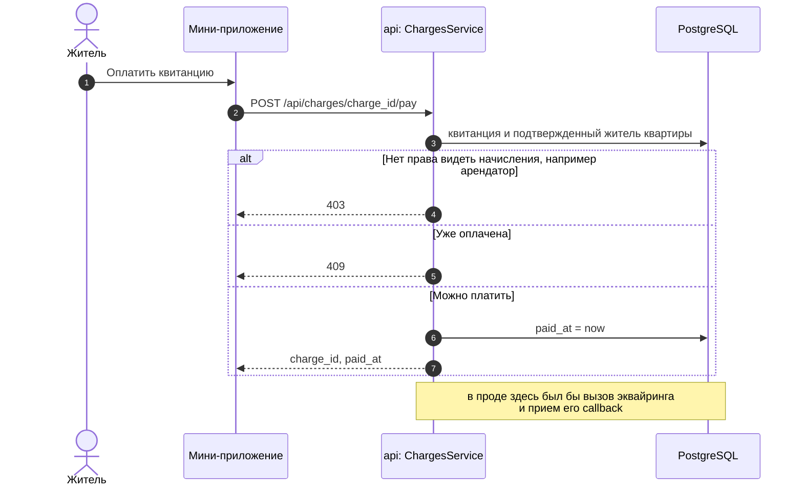

PlantUML: [`16-seq-demo-payment.puml`](architecture/plantuml/16-seq-demo-payment.puml)

## Развертывание и доставка

Прод - один VPS с Docker. MAX принимает вебхук и открывает мини-приложение
только по HTTPS на 443 с настоящим сертификатом, поэтому перед compose стоит
nginx хоста с TLS. Push в `master` деплоит GitHub Actions по SSH, отдельный
workflow каждые 15 минут проверяет стенд и при сбое пишет капитану через Bot
API

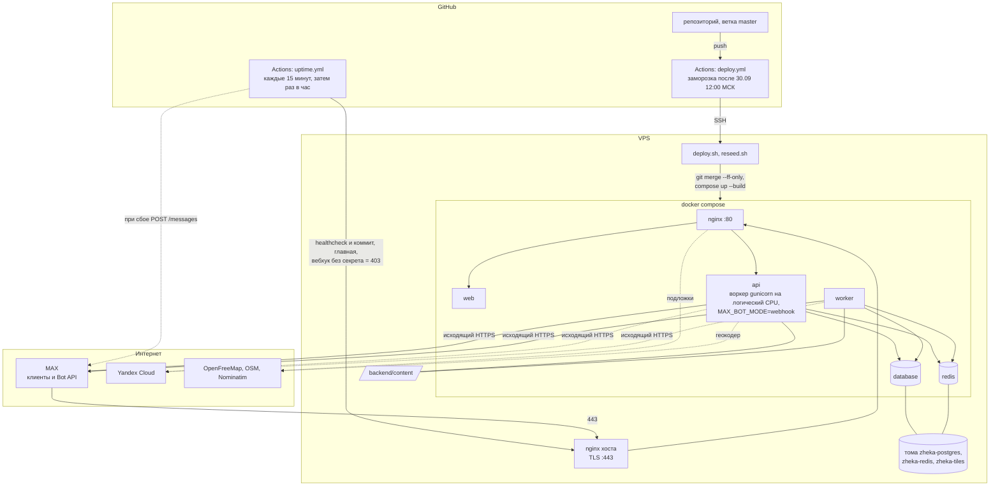

PlantUML: [`05-deployment.puml`](architecture/plantuml/05-deployment.puml)

Маршруты nginx в compose:

| Путь | Куда | Особенности |
|------|------|-------------|
| `/` | `web:80` | статика SPA, фолбэк на `index.html` |
| `= /api/files` | `api:7001` | `client_max_body_size 60m`: видео до 50 МБ |
| `/api/` | `api:7001` | `client_max_body_size 15m`, `/api` и `/api/` уводят на `/api/docs` |
| `/files/` | `api:7001` | файлы по подписанной ссылке, `X-Content-Type-Options: nosniff` |
| `/tiles/ofm/`, `/tiles/osm/` | OpenFreeMap, OSM | кэш в томе `zheka-tiles` до 2 ГБ, stale при ошибках источника |
| `= /webhook` | `api:7001` | таймауты 35 с, MAX ждет ответа 30 с |

## Стек

Бэкенд (`backend/pyproject.toml`): Python 3.12, FastAPI 0.141.1, Pydantic 2.13.5, gunicorn 26.2.0 без uvicorn, maxo 0.9.0 (бот и диалоги), dishka 1.10.1 (DI), SQLAlchemy 2.0.53 с psycopg 3.3.5, alembic 1.20.0, taskiq 0.12.6 на Redis, aiohttp 3.14.3 для внешних API, fpdf2 2.8.8 для PDF. Проверки: ruff, black, mypy strict, bandit, slotscheck, pytest с testcontainers

Фронтенд (`frontend/package.json`): React 19, TypeScript 6, Vite 8, `@maxhub/max-ui` 0.5, react-router 7, TanStack Query 5 с `openapi-fetch` по типам из `openapi.yaml`, react-hook-form и zod, MapLibre GL 6.11, recharts 3, motion, `qrcode.react`. MAX Bridge подключается скриптом `st.max.ru/js/max-web-app.js`

Инфраструктура (`docker-compose.yml`): PostgreSQL 16.9, Redis 7.4, nginx 1.27. Деплой на VPS через GitHub Actions

## Слои бэкенда

`backend/zheka/`:

- `core/` - предметная область. `models/` - сущности без SQLAlchemy (обычные изменяемые классы), `services/` - вся бизнес-логика, общая для API, бота и задач. Здесь же `enums/`, доменные ошибки `errors.py`, типизированные id (`ids.py`, `NewType`) и статичные справочники: `pp290.json`, `city_services.csv`, календарь `workdays.py`, модель отключений `outages.py`
- `infra/` - все, что ходит наружу. `database/tables/` описывает 41 таблицу через `Table` и маппит сущности `map_imperatively`, `database/repos/` - репозитории над `AsyncSession`. Еще клиент отправки MAX с лимитами, клиенты Yandex и Nominatim, квоты, PDF
- `api/` - роуты FastAPI, схемы Pydantic (только здесь), зависимости авторизации и организации, обработка ошибок в один конверт
- `bot/` - диспетчер maxo: экраны на `maxo.dialogs`, обработчики по сценариям, middleware пользователя, транзакции и троттлинга
- `broker/` - задачи taskiq, расписание, `TaskPublisher`
- `di/` - провайдеры dishka со `STRICT_VALIDATION`, репозитории через `provide_all`
- `seed/` - демо-данные

Роут или обработчик бота берет сервис из контейнера, сервис работает с репозиториями и публикует задачи. Протоколов для репозиториев и отдельного Unit of Work нет. Транзакцию закрывает одна точка на входе: HTTP-middleware коммитит ответы ниже 400, `CommitMiddleware` - задачи, `TransactionMiddleware` - апдейты бота. Исключение откатывает все

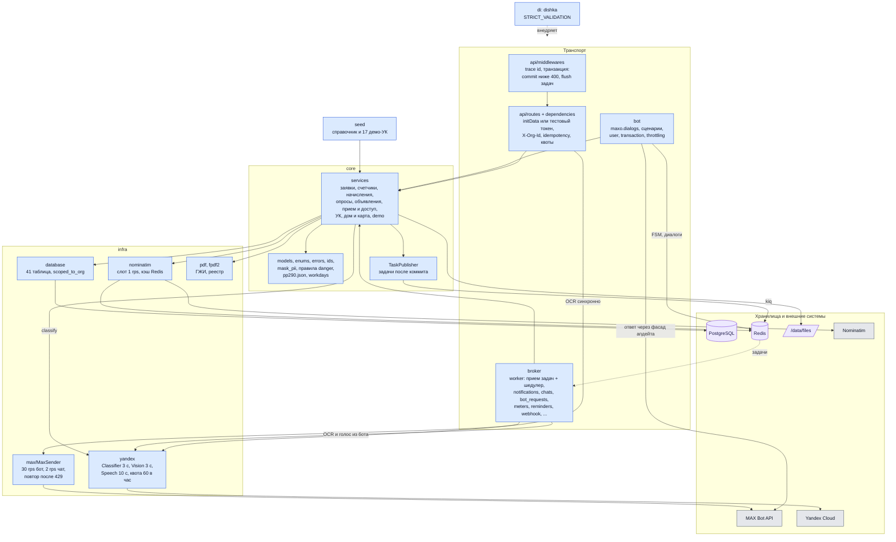

PlantUML: [`03-backend-components.puml`](architecture/plantuml/03-backend-components.puml)

Правила, которые видны на схеме:

- Сервис не отправляет сообщений сам: он публикует задачу, а `TaskPublisher`
  ставит ее в Redis только после коммита. Откат не отправляет ничего
- Обработчик вебхука не качает файлы, не зовет OCR и SpeechKit - это задачи
  `bot_requests` и `meters`, чтобы уложиться в 30 секунд на ответ MAX
- Подсказка категории и OCR из мини-приложения - синхронные вызовы с
  таймаутом 3 секунды, SpeechKit работает только из задачи
- Изоляция УК - зависимость `current_org` и фильтр `scoped_to_org` в
  репозиториях: чужая УК - 403, чужой объект внутри своей - 404

## Фронтенд

Фронтенд разделен на `app/` (роутер, загрузчики запуска, анимация экранов), `features/` (экран или сценарий на папку) и `shared/` (клиент API, UI, утилиты); импорты идут только вниз, это проверяет eslint. Вне MAX мини-приложение показывает заглушку Мини-приложение на React 19 + Vite, UI-кит `@maxhub/max-ui`, данные через
TanStack Query поверх `openapi-fetch`. Типы генерируются из `openapi.yaml` в
корне репозитория (`pnpm api`). Импорты идут только вниз: `app` -> `features`
-> `shared`, это проверяет eslint

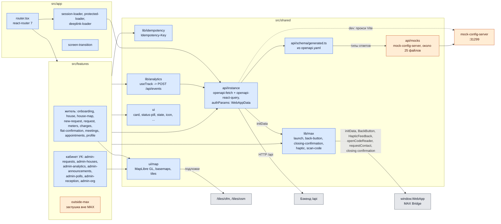

PlantUML: [`04-frontend-components.puml`](architecture/plantuml/04-frontend-components.puml)

## Модель данных

Основные сущности и связи, без перечня колонок:

- Организация (`organizations`, `org_settings`) - УК. Зарегистрированная УК (`registered_at`) делает свои дома подключенными. Настройки: окно подачи показаний (по умолчанию 15-25 число), порог склейки заявок (3 за 24 часа), часовой пояс офиса
- Дом (`houses`) принадлежит организации или никому (`org_id` пустой). Паспорт из открытых данных лежит в `houses.passport`, у дома свой часовой пояс. Квартиры (`flats`) - с подъездом, площадью и лицевым счетом
- Пользователь (`users`) - аккаунт MAX с версией согласия. Житель (`residents`) - связь пользователя с домом и, если указана, квартирой: собственник или арендатор, подтвержден или нет, активен или заблокирован, председатель (один на дом, частичный уникальный индекс). Сотрудник (`org_members`) - роль в организации. Один аккаунт может быть жителем в нескольких домах и сотрудником нескольких УК
- Приглашения: `org_invites` (роль в УК), `flat_invites` (арендатор в квартиру, открывает `tenancies`), `chairman_handovers`. Подтверждение квартиры: `flat_verification_requests`, отозванные - `verification_revocations`
- Заявка (`requests`) - дом, квартира, автор, категория, место (личная или общая), канал (мини-приложение, бот, звонок), статус, исполнитель, сроки. К ней журнал статусов, переписка, вложения, повторная заявка ссылается на родителя. Коллективные заявки одного дома и категории собирает `request_groups`
- Счетчики и деньги: `meters`, `readings` (по периодам, по тарифным зонам), `tariffs` с историей `valid_from`, `charges` со строками начисления
- Общение: `announcements` (в том числе плановые работы) и реестр доставки `notice_deliveries`, опросы (`polls`, `poll_options`, `poll_votes`), предложения совету дома, домовые чаты (`chats`, `chat_pins`, `chat_cards`)
- Прием и доступ: `reception_windows`, `appointments`, сбор доступа в квартиры (`access_requests`, `access_slots`, `access_targets`)
- Служебное: `events` (62 типа для аналитики, у входов с меткой источника: прямой запуск, QR, чат, диплинк, мини-приложение), `demand_signals` («мне нужен этот сервис» у неподключенного дома), `idempotency_keys`, `notification_settings`

Дробные величины хранятся целыми: деньги в копейках, тариф в 1/10000 рубля, площадь в 1/100 м2, объем и показания в 1/1000, проценты в 1/100. Время хранится в UTC, дни и сроки считаются в поясе дома или УК

## Роли и авторизация

- Мини-приложение передает подписанную `initData` из MAX Bridge в заголовке `WebAppData`. API проверяет HMAC на токене бота; без `initData` или с неверной подписью - 401. Срок `auth_date` намеренно не проверяется, поэтому утекшая `initData` действует, пока не сменят токен бота
- Житель: собственник или арендатор. Арендатор не видит начислений и не голосует с весом площади. Неподтвержденный житель подает заявки, записывается на прием и голосует без веса; начисления, счетчики и вес голоса требуют подтвержденной квартиры (лицевой счет, QR квитанции, приглашение собственника или решение УК)
- Кабинет УК: `creator`, `admin`, `employee`. Исполнитель (`executor`) работает только в боте, API кабинета отвечает ему 403
- Запросы сотрудника несут `X-Org-Id`, если он состоит в нескольких УК
- Для проверки без MAX есть тестовый токен (`API_TEST_TOKEN`, заголовок `Authorization: Bearer`): одна служебная учетная запись «Проверяющий API», см. «DATA-API» ниже

### Запуск мини-приложения и авторизация

Логина нет: каждый запрос несет подписанные данные запуска MAX. Для проверки
без MAX есть тестовый токен одной служебной учетной записи

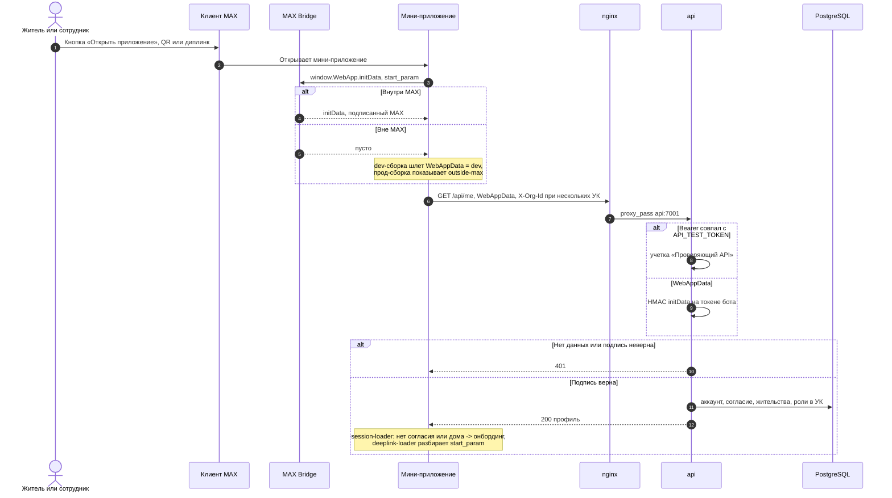

PlantUML: [`08-seq-miniapp-auth.puml`](architecture/plantuml/08-seq-miniapp-auth.puml)

## События и уведомления

Сервис не отправляет сообщения сам. Он публикует задачу по имени через `TaskPublisher`, а тот ставит задачи в Redis только после коммита. Откат транзакции не отправляет ничего

Задача рассылки берет уровень из настроек жителя: категории заявки, объявления, счетчики, дайджест; уровни со звуком, без звука, выключено. По умолчанию все без звука, дайджест выключен. Обязательные уведомления (статусы своих заявок, карточки исполнителя и приемки, окна доступа, итог подтверждения квартиры, блокировка) выключить нельзя, только лишить звука

`MaxSender` соблюдает лимиты MAX, пропускает тех, кто остановил бота или ни разу его не запускал, и не повторяет отправку, кроме одного повтора после 429. Карточки исполнителя, приемки и сбора доступа - одно сообщение, которое бот редактирует. Карточки в домовом чате рендерятся из базы под блокировкой, так что поздняя задача не нарисует старое состояние

Расписание воркера (UTC):

| Когда | Что |
|---|---|
| каждую минуту | автозакрытие приемки через 48 часов |
| каждые 5 минут | контроль сроков заявок: предупреждение, затем просрочка |
| каждые 10 минут | проверка, что MAX не потерял вебхук |
| каждый час | напоминания о показаниях, опросах, поверке, приеме, закрытие опросов, воскресный дайджест; срабатывают там, где местное время дошло до нужного часа |
| 03:30 | уборка файлов |
| 03:45 | удаление старых ключей идемпотентности |

### Транзакция, задачи и уведомления

Задача уходит в очередь только после коммита. Рассылка - цикл через очередь с
ограничителями платформы

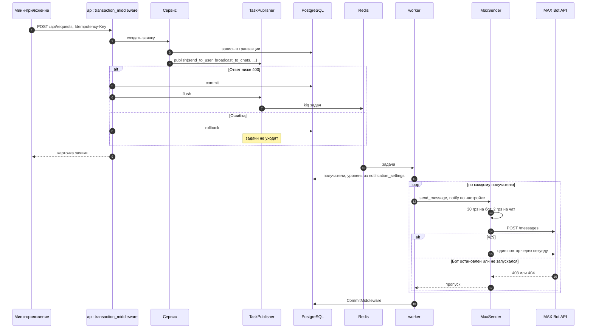

PlantUML: [`10-seq-tasks-notifications.puml`](architecture/plantuml/10-seq-tasks-notifications.puml)

## Ограничения MAX, которые определили устройство

- Вебхук должен ответить 200 за 30 секунд: скачивание файлов, OCR и расшифровка уходят в задачи
- 30 сообщений в секунду на бота и 2 в секунду в один чат, массовой отправки нет: рассылка - цикл через очередь с ограничителями, при массовой рассылке сообщения просто ждут
- Бот не пишет первым тому, кто его не запускал: у заявки по звонку обратный канал только телефон
- События о смене прав бота в чате нет: права проверяются по кнопке «Готово» и после каждой неудачной отправки в чат
- События о ручном закрепе нет: бот ведет свой список закрепов и не спорит с чужим
- Текст сообщения до 4000 символов, к заявке до 12 вложений
- maxo 0.9.0 доставляет текст и фото только в основной стек диалогов, поэтому окна ввода открываются там

### Апдейты бота: вебхук и опрос

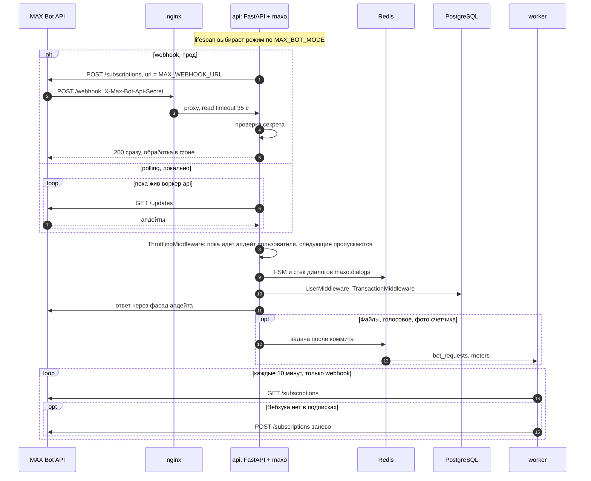

PlantUML: [`09-seq-bot-updates.puml`](architecture/plantuml/09-seq-bot-updates.puml)

## Нефункциональные свойства

### Изоляция данных между УК

Все запросы кабинета идут через зависимость текущей организации и фильтр `scoped_to_org` в репозиториях. Сотрудник чужой УК получает 403 «Нет доступа к этой организации», а чужие дом, заявка или группа внутри своей УК отвечают 404, не 403: перебором нельзя узнать, существует ли чужой id. Персональные данные жителя видит только УК его дома; публичная карточка дома и карта показывают только адрес, паспорт, контакты и публичную статистику УК

Фото и документы лежат на диске под случайными именами и отдаются по ссылке с HMAC-подписью, которая живет час. Право на файл проверяется при выдаче ссылки. Подделанная или истекшая ссылка отвечает «Файл не найден»

Без согласия на обработку данных (текущая версия `1.2`) бот и API не дают привязать дом и подать заявку; старая версия согласия отклоняется с указанием актуальной. «Удалить мои данные» стирает жительство, роли, настройки и телефон, обезличивает аккаунт и сбрасывает согласие; заявки, показания и голоса остаются

### Маскирование перед YandexGPT

Перед запросом к модели текст заявки проходит `mask_pii` (`core/masking.py`) внутри самого клиента, так что его не минует ни один вызов. Заменяются телефоны, e-mail, числа от 8 цифр (лицевой счет, СНИЛС) и номера квартир («кв. 45», «в 7-й квартире»). Числа со смыслом остаются: «45 градусов», «2 подъезд», «дом 61/1». Заявка хранится без изменений, маскируется только копия для модели

Не маскируются имена и адреса, номер квартиры без слова «кв.» или «квартира» и телефон в непривычной записи. Фото счетчиков уходят в Vision без изменений; это раскрыто в политике обработки данных

### Идемпотентность

Создающие действия принимают заголовок `Idempotency-Key` (UUID): заявка и ее повтор, сообщение жителя по заявке, заявка по звонку, ответ УК, опрос дома или УК, инициатива, предложение совету дома, спор по начислению, объявление. Повтор с тем же ключом отдает сохраненный ответ, ключ на другом пути дает «Ключ уже использован для другого действия», параллельный повтор - «Запрос с этим ключом еще выполняется». Ключи живут сутки

Смена статуса заявки защищена иначе: переход в текущий статус ничего не делает и отвечает той же карточкой, назад статус не двигается. Каждая запись статуса берет блокировку строки. Назначение исполнителя от двойного нажатия защищает только кнопка в интерфейсе

### Лимиты

| Что | Лимит | Сверх лимита |
|---|---|---|
| Подсказка категории, OCR, расшифровка голоса (вместе) | 60 в час на пользователя | Ответ как без ключей Yandex |
| Загрузка файлов | 30 в час на пользователя | 429 «Слишком много запросов, попробуйте позже» |
| Поиск дома по точке на карте | 60 в час | 429 |
| Добавление нового дома | 5 в час | «Слишком много новых домов, попробуйте через час» |
| Подтверждение квартиры (счет или QR) | 10 попыток в час, удачные тоже | 429 |
| Nominatim | 1 запрос в секунду на все приложение, ответы в кэше Redis 30 дней | После 1,5 с ожидания - ошибка геокодера |
| Отправка в MAX | 30 в секунду на бота, 2 в секунду в чат | Очередь |
| Свободный текст в запросах | 4000 символов | 400, ошибки валидации приходят как 400, а не 422 |

Счетчики лимитов живут в памяти каждого процесса: у нескольких воркеров `api` потолок умножается на их число и обнуляется при перезапуске. Лимит по IP невозможен: nginx на хосте скрывает адрес клиента. Пока бот обрабатывает апдейт пользователя, следующие апдейты этого пользователя он пропускает

### Проверка файлов

Тип файла сервер определяет по первым байтам, а не по `Content-Type` клиента. Для фото и видео разрешены JPEG, PNG, WEBP, HEIC, MP4 и MOV; остальное отклоняется с 400 «Поддерживаются только изображения и видео MP4 или MOV» и удаляется с диска. Фото под видом видео и наоборот тоже отклоняется. Размер считается при записи: фото до 10 МБ, видео до 50 МБ. Документы плановых работ УК загружает отдельно, только PDF с сигнатурой `%PDF-`. `/files/` отдается с `X-Content-Type-Options: nosniff`

Сервер сверяет сигнатуру, но не декодирует изображение: файл с настоящим заголовком и чем угодно дальше пройдет

Тег `` не умеет слать `WebAppData`, поэтому право на файл проверяется
при выдаче ссылки, а ссылка подписана HMAC и живет час

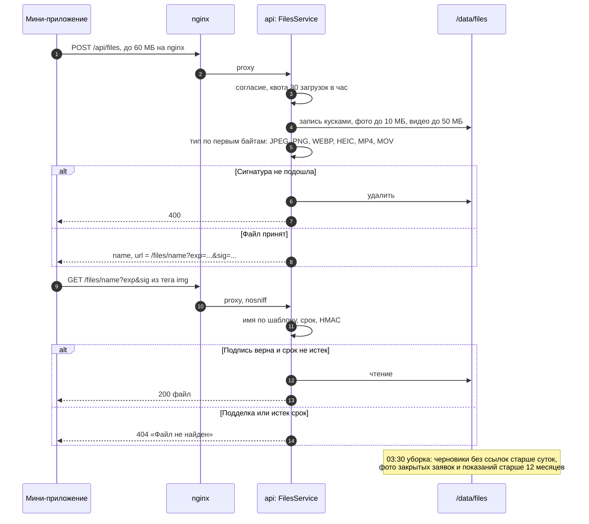

PlantUML: [`14-seq-files.puml`](architecture/plantuml/14-seq-files.puml)

### Защита демо-стенда

Демо-УК общие для всех проверяющих, поэтому:

- заблокировать жителя, отозвать подтверждение квартиры, снять или сменить председателя можно только у модельного жителя (без реального аккаунта MAX) или у себя: «В демо-УК можно ограничить только модельных жителей»;
- настройки УК, исполнители по категориям, часы приема и исключение сотрудника закрыты: 403 «Демо-УК общая для всех проверяющих, это действие в ней отключено», в интерфейсе эти поля только для чтения;
- приглашение отзывает и плановые работы завершает только их автор;
- адресное объявление в демо-УК доходит только автору, телефон жителя сотрудник видит только свой;
- заявки склеиваются от 10 квартир, а не от 3, чтобы заявки разных проверяющих в первом доме не слипались; коллективную заявку с одного аккаунта собирает кнопка «Демо: соседи сообщили»

Демо-УК №5 отдана тестовому токену: демо-ссылок на нее нет, живой аккаунт ее не займет. Токен, в свою очередь, получает только роль сотрудника этой УК, ведет свою тестовую заявку только до статуса «Принята» и не собирает к ней демо-соседей: на ней держатся обязательные проверки DATA-API

### DATA-API

`openapi.yaml` описывает весь API мини-приложения, `DATA-API.yaml` - 16 обязательных проверок по схеме организаторов DATA-API 1.0. Роли resident и staff в проверках - одна учетная запись тестового токена, public идет без токена. Первые две проверки дают согласие и демо-доступ к демо-УК №5, обе идемпотентны. Токен записан в заголовке `Authorization` каждой проверки с ролью resident или staff. Соответствие путей двух файлов и актуальность `openapi.yaml` проверяют тесты

### Версия сборки и мониторинг

`GET /api/healthcheck` без авторизации проверяет базу и отвечает `{"ok":true,"commit":"<хэш>"}`: коммит запекается в образ при деплое (`BUILD_COMMIT`), локальная сборка отвечает `dev`. Отказы API приходят в одном конверте, причина - в `error.detail`; сводка отказов - в README, «Памятка проверяющему»

GitHub Actions (`.github/workflows/uptime.yml`) проверяет стенд каждые 15 минут с 30.09 по 14.10 и раз в час с 15.10 по 29.10: healthcheck и коммит, главную страницу, отказ вебхука без секрета (403). При сбое бот пишет капитану команды

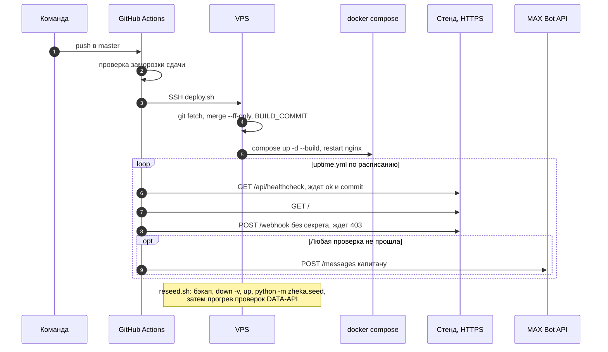

PlantUML: [`17-seq-deploy-uptime.puml`](architecture/plantuml/17-seq-deploy-uptime.puml)

### Фоновая уборка

- 03:30: удаляются файлы без ссылок старше суток (черновики загрузок), затем снимаются ссылки на фото заявок, закрытых больше 12 месяцев назад, и на фото показаний старше 12 месяцев. Сами файлы уходят следующим запуском, поэтому откат транзакции не оставляет строк без файлов
- 03:45: удаляются ключи идемпотентности старше суток
- Каждые 10 минут в режиме вебхука бот сверяет подписки MAX и регистрирует вебхук заново, если MAX его потерял
- Демо-данные по расписанию не заполняются: только `/seed` в личке с ботом или `python -m zheka.seed` на пустой базе. Повторный запуск ничего не меняет
