# Архитектура в диаграммах

Системный дизайн «Жэки Коммуналкина» в картинках: из чего состоит решение,
как части связаны между собой и со всеми внешними системами - реальными и
подменными (моки, заглушки, демо-режимы, фолбэки). Текстовое описание
архитектуры - в [`docs/architecture.md`](../architecture.md), этот раздел его
иллюстрирует и не заменяет.

Каждая диаграмма есть в двух видах:

- **Mermaid** - прямо в этом файле, GitHub и большинство IDE рисуют ее сами;
- **PlantUML** - исходники в [`plantuml/`](plantuml/), схемы архитектуры в
  нотации C4. Рендер из корня репозитория:
  `docker run --rm -v "$PWD/docs/architecture/plantuml:/data" plantuml/plantuml -tsvg '/data/*.puml'`.

| # | Диаграмма | Mermaid | PlantUML |
|---|-----------|---------|----------|
| 1 | Системный контекст | [раздел 1](#1-системный-контекст) | [`01-context.puml`](plantuml/01-context.puml) |
| 2 | Контейнеры | [раздел 2](#2-контейнеры) | [`02-containers.puml`](plantuml/02-containers.puml) |
| 3 | Компоненты бэкенда | [раздел 3](#3-компоненты-бэкенда) | [`03-backend-components.puml`](plantuml/03-backend-components.puml) |
| 4 | Компоненты фронтенда | [раздел 4](#4-компоненты-фронтенда) | [`04-frontend-components.puml`](plantuml/04-frontend-components.puml) |
| 5 | Развертывание и доставка | [раздел 5](#5-развертывание-и-доставка) | [`05-deployment.puml`](plantuml/05-deployment.puml) |
| 6 | Внешние системы: реальные и моки | [раздел 6](#6-внешние-системы-реальные-и-моки) | [`06-integrations.puml`](plantuml/06-integrations.puml) |
| 7 | Режимы окружения | [раздел 7](#7-режимы-окружения) | [`07-environments.puml`](plantuml/07-environments.puml) |
| 8 | Запуск мини-приложения и авторизация | [раздел 8.1](#81-запуск-мини-приложения-и-авторизация) | [`08-seq-miniapp-auth.puml`](plantuml/08-seq-miniapp-auth.puml) |
| 9 | Апдейты бота: вебхук и опрос | [раздел 8.2](#82-апдейты-бота-вебхук-и-опрос) | [`09-seq-bot-updates.puml`](plantuml/09-seq-bot-updates.puml) |
| 10 | Транзакция, задачи и уведомления | [раздел 8.3](#83-транзакция-задачи-и-уведомления) | [`10-seq-tasks-notifications.puml`](plantuml/10-seq-tasks-notifications.puml) |
| 11 | Подсказка категории заявки (LLM) | [раздел 8.4](#84-подсказка-категории-заявки-llm) | [`11-seq-classify.puml`](plantuml/11-seq-classify.puml) |
| 12 | Показание счетчика по фото (OCR) | [раздел 8.5](#85-показание-счетчика-по-фото-ocr) | [`12-seq-ocr.puml`](plantuml/12-seq-ocr.puml) |
| 13 | Голосовое в боте (SpeechKit) | [раздел 8.6](#86-голосовое-в-боте-speechkit) | [`13-seq-voice.puml`](plantuml/13-seq-voice.puml) |
| 14 | Загрузка и отдача файлов | [раздел 8.7](#87-загрузка-и-отдача-файлов) | [`14-seq-files.puml`](plantuml/14-seq-files.puml) |
| 15 | Карта: подложки и геокодер | [раздел 8.8](#88-карта-подложки-и-геокодер) | [`15-seq-map.puml`](plantuml/15-seq-map.puml) |
| 16 | Демо-оплата квитанции | [раздел 8.9](#89-демо-оплата-квитанции) | [`16-seq-demo-payment.puml`](plantuml/16-seq-demo-payment.puml) |
| 17 | Деплой и мониторинг стенда | [раздел 8.10](#810-деплой-и-мониторинг-стенда) | [`17-seq-deploy-uptime.puml`](plantuml/17-seq-deploy-uptime.puml) |

Условные обозначения на всех диаграммах:

- сплошная линия - основной путь, работает в коде;
- пунктир - необязательная связь, фолбэк, подмена или разовая операция;
- синим - наша система, серым - внешняя реальная система, оранжевым - мок,
  заглушка, демо-режим или фолбэк вместо внешней системы.

## 1. Системный контекст

Решение живет внутри MAX: житель и сотрудник УК открывают мини-приложение из
клиента MAX, исполнитель работает только в боте, бот пишет в личные сообщения
и домовые чаты. Обязателен только MAX. Сервисы Yandex, подложки карты и
геокодер необязательны: без каждого есть фолбэк. ГИС ЖКХ и Реформа ЖКХ в
рантайме не вызываются - их данные собраны в сид заранее.

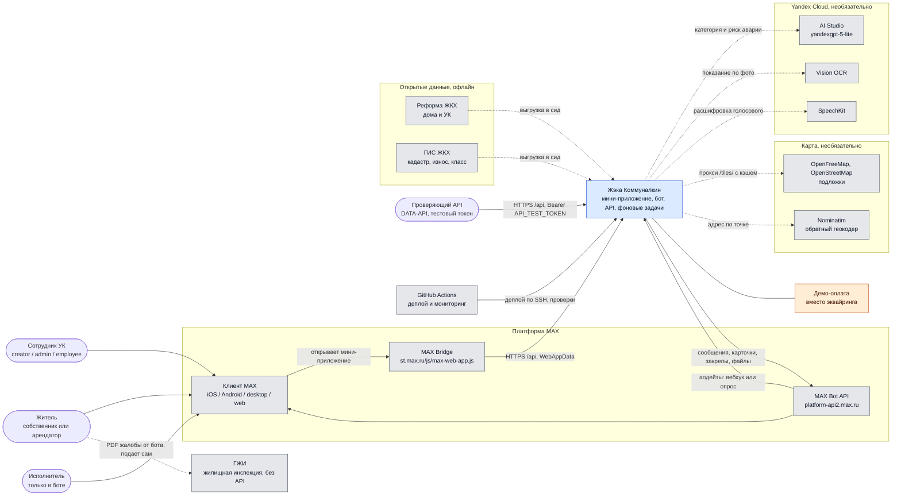

## 2. Контейнеры

Все локальные компоненты поднимает `docker compose up`. Наружу опубликован
только порт nginx. `migrations` собирает образ `zheka:local`, а `api` и
`worker` берут его же (`pull_policy: never`) и отличаются только командой.
TLS в репозитории не настроен: на проде его снимает nginx хоста перед compose.

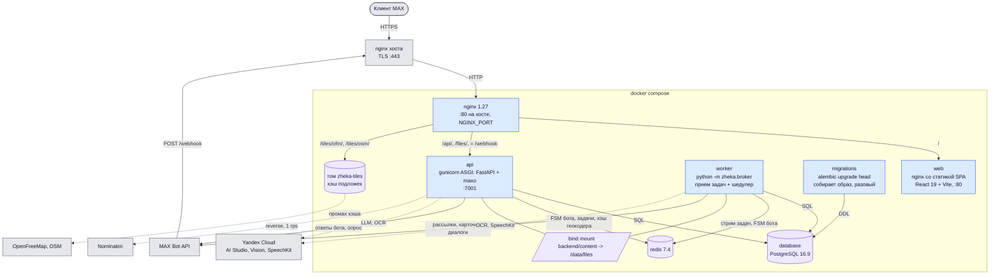

Порядок старта задают `depends_on`: `database` и `redis` проходят healthcheck,
один раз отрабатывает `migrations`, затем стартуют `api` и `worker`, nginx
ждет здорового `api`.

| Контейнер | Что делает | Порт | Хранилища |
|-----------|-----------|------|-----------|
| `nginx` | Единая точка входа, разводит пути, кэширует подложки карты | 80 на хосте | том `zheka-tiles` |
| `web` | Собранный SPA, SPA-фолбэк, кэш `/assets/` | 80 в сети compose | - |
| `api` | REST мини-приложения и кабинета УК, бот на maxo в том же процессе | 7001 в сети compose | Postgres, Redis, файлы |
| `worker` | Прием задач taskiq и шедулер в одном процессе | - | Postgres, Redis, файлы |
| `migrations` | Собирает образ бэкенда, применяет alembic и завершается | - | Postgres |
| `database` | Данные домена, события аналитики, ключи идемпотентности | 5432 в сети compose | том `zheka-postgres` |
| `redis` | FSM и диалоги бота, очередь и расписание taskiq, кэш и слот Nominatim | 6379 в сети compose | том `zheka-redis` |

## 3. Компоненты бэкенда

Пакет `zheka`, Python 3.12, все асинхронно. Транспорт (`api`, `bot`,
`broker`) берет сервисы из контейнера dishka, сервисы работают с
репозиториями и публикуют задачи через `TaskPublisher`. Все, что ходит
наружу, лежит в `infra/`. Транзакцию закрывает одна точка на входе: HTTP -
`transaction_middleware`, задачи - `CommitMiddleware`, апдейты бота -
`TransactionMiddleware`.

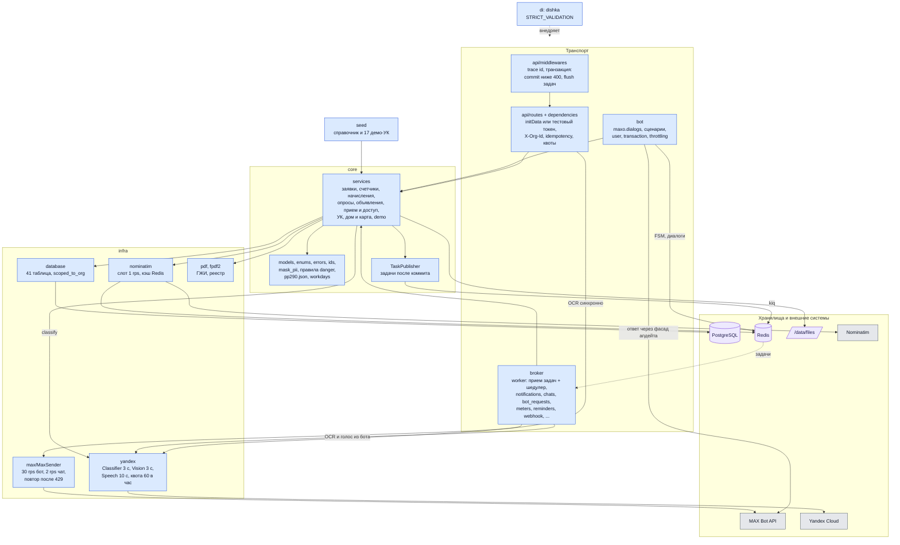

Правила, которые видны на схеме:

- Сервис не отправляет сообщений сам: он публикует задачу, а `TaskPublisher`
  ставит ее в Redis только после коммита. Откат не отправляет ничего.
- Обработчик вебхука не качает файлы, не зовет OCR и SpeechKit - это задачи
  `bot_requests` и `meters`, чтобы уложиться в 30 секунд на ответ MAX.
- Подсказка категории и OCR из мини-приложения - синхронные вызовы с
  таймаутом 3 секунды, SpeechKit работает только из задачи.
- Изоляция УК - зависимость `current_org` и фильтр `scoped_to_org` в
  репозиториях: чужая УК - 403, чужой объект внутри своей - 404.

## 4. Компоненты фронтенда

Мини-приложение на React 19 + Vite, UI-кит `@maxhub/max-ui`, данные через
TanStack Query поверх `openapi-fetch`. Типы генерируются из `openapi.yaml` в
корне репозитория (`pnpm api`). Импорты идут только вниз: `app` -> `features`
-> `shared`, это проверяет eslint.

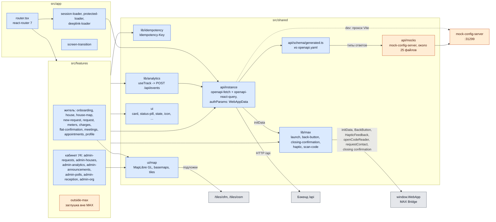

## 5. Развертывание и доставка

Прод - один VPS с Docker. MAX принимает вебхук и открывает мини-приложение
только по HTTPS на 443 с настоящим сертификатом, поэтому перед compose стоит
nginx хоста с TLS. Push в `master` деплоит GitHub Actions по SSH, отдельный
workflow каждые 15 минут проверяет стенд и при сбое пишет капитану через Bot
API.

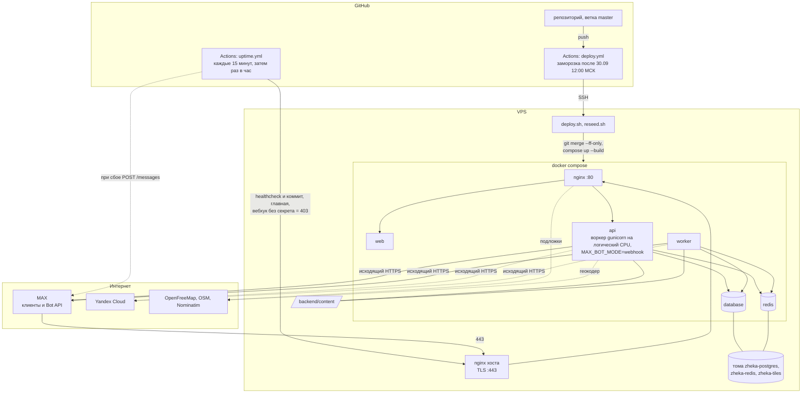

Маршруты nginx в compose:

| Путь | Куда | Особенности |
|------|------|-------------|
| `/` | `web:80` | статика SPA, фолбэк на `index.html` |
| `= /api/files` | `api:7001` | `client_max_body_size 60m`: видео до 50 МБ |
| `/api/` | `api:7001` | `client_max_body_size 15m`, `/api` и `/api/` уводят на `/api/docs` |
| `/files/` | `api:7001` | файлы по подписанной ссылке, `X-Content-Type-Options: nosniff` |
| `/tiles/ofm/`, `/tiles/osm/` | OpenFreeMap, OSM | кэш в томе `zheka-tiles` до 2 ГБ, stale при ошибках источника |
| `= /webhook` | `api:7001` | таймауты 35 с, MAX ждет ответа 30 с |

## 6. Внешние системы: реальные и моки

Каждая строка - одна точка интеграции: наш компонент, реальная система и то,
что работает вместо нее, когда ее нет. «Мок» здесь - любая подмена: мок-сервер,
заглушка, фолбэк, демо-реализация, тестовый токен или данные-сиды.

```mermaid
flowchart LR
    subgraph i8["Доставка и мониторинг"]
        direction LR
        gh8["GitHub Actions"] -- "push в master" --> vps8["VPS: deploy.sh"]
        gh8 -- "uptime.yml" --> stand8["стенд: healthcheck,<br/>главная, вебхук"]
        gh8 -. "при сбое" .-> botapi8["MAX Bot API:<br/>сообщение капитану"]
    end

    subgraph i7["Данные домов и демо"]
        direction LR
        seed7["seed"] -. "выгрузка заранее" .-> reforma["Реформа ЖКХ<br/>дома, УК"]
        seed7 -. "выгрузка заранее" .-> gis["ГИС ЖКХ<br/>кадастр, износ"]
        seed7 --> demo7["17 демо-УК, модельные<br/>жители и начисления за полгода"]
        bot7["бот /start"] --> links7["demo_resident_N, demo_staff_N,<br/>demo_admin_N, demo_executor_N"]
    end

    subgraph i6["Деньги и документы"]
        direction LR
        charges["ChargesService"] -. "не делаем" .-> acq["Эквайринг"]
        charges --> pay["Демо-оплата: paid_at = now"]
        charges -. "точка интеграции" .-> bill["Биллинг УК"]
        charges --> modelbill["Модельные начисления"]
        pdf6["pdf/gji"] -. "житель подает сам" .-> gzhi["ГЖИ"]
    end

    subgraph i5["Карта"]
        direction LR
        map5["MapLibre + nginx /tiles/"] -- "промах кэша" --> tiles["OpenFreeMap, OSM"]
        map5 -. "нет WebGL или ошибка" .-> list5["выбор дома списком"]
        geo5["NominatimClient"] -- "1 rps, кэш 30 дней" --> nom["Nominatim"]
        geo5 -. "ожидание слота дольше 1,5 с" .-> nogeo["ошибка геокодера,<br/>дом только из справочника"]
    end

    subgraph i4["ИИ: Yandex Cloud"]
        direction LR
        cls["YandexClassifier"] -- "ключ задан" --> llm["AI Studio<br/>yandexgpt-5-lite"]
        cls -. "нет ключа, отказ, таймаут,<br/>60 в час исчерпаны" .-> rules["кнопки категорий<br/>и правила danger"]
        vis["VisionClient"] -- "ключ задан" --> ocr["Vision OCR"]
        vis -. "нет ключа или сбой" .-> manual["житель вводит число"]
        stt4["SpeechClient"] -- "MAX не расшифровал" --> stt["SpeechKit"]
        stt4 -. "нет ключа или сбой" .-> text4["просьба написать текстом"]
    end

    subgraph i3["Бот"]
        direction LR
        api3["api: maxo"] -- "MAX_BOT_MODE=webhook" --> botapi["MAX Bot API"]
        api3 -. "MAX_BOT_MODE=polling, локально" .-> polling["опрос GET /updates<br/>без домена и сертификата"]
        worker3["worker: MaxSender, keep_webhook"] --> botapi
    end

    subgraph i2["Бэкенд для фронтенда"]
        direction LR
        fe2["Мини-приложение"] -- "prod и compose" --> back["api за nginx"]
        fe2 -. "pnpm mock, DEV_API_TARGET" .-> mcs["mock-config-server :31299<br/>почти весь openapi.yaml"]
    end

    subgraph i1["Запуск и авторизация"]
        direction LR
        fe1["Мини-приложение"] -- "внутри MAX" --> bridge["MAX Bridge: initData"]
        fe1 -. "dev-сборка вне MAX" .-> devinit["WebAppData = dev"]
        fe1 -. "прод-сборка вне MAX" .-> outside["экран outside-max"]
        checker["DATA-API, curl"] -. "без MAX" .-> token["Bearer API_TEST_TOKEN:<br/>учетка «Проверяющий API»,<br/>демо-УК №5"]
    end

    classDef ours fill:#dbeafe,stroke:#1d4ed8,color:#0f172a
    classDef ext fill:#e5e7eb,stroke:#4b5563,color:#111827
    classDef mock fill:#ffedd5,stroke:#c2410c,color:#431407
    class fe1,fe2,back,api3,worker3,cls,vis,stt4,map5,geo5,charges,pdf6,seed7,bot7,gh8,vps8,stand8,checker ours
    class bridge,botapi,botapi8,llm,ocr,stt,tiles,nom,acq,bill,gzhi,reforma,gis ext
    class devinit,outside,token,mcs,polling,rules,manual,text4,list5,nogeo,pay,modelbill,demo7,links7 mock
```

| Внешняя система | Кто и как ходит | Настройка | Без нее или вместо нее |
|-----------------|-----------------|-----------|------------------------|
| MAX Bot API `platform-api2.max.ru` | `api` отвечает на апдейты, `worker` шлет уведомления, карточки в чатах, закрепы, диалоги, качает файлы из сообщений | `MAX_TOKEN` | не работает ничего, в Docker не воспроизвести |
| MAX вебхук (входящий) | MAX шлет апдейты на `/webhook`, секрет в `X-Max-Bot-Api-Secret`; `keep_webhook` каждые 10 минут перерегистрирует потерянный | `MAX_BOT_MODE`, `MAX_WEBHOOK_URL`, `MAX_SECRET_TOKEN` | локально `polling`, домен и сертификат не нужны |
| MAX Bridge | фронт читает `window.WebApp`: `initData`, `BackButton`, `HapticFeedback`, `openCodeReader` (QR квитанции), `requestContact` (телефон), подтверждение закрытия | - | dev-сборка вне MAX шлет `WebAppData: dev`, прод-сборка показывает `outside-max` |
| Подпись `initData` | `current_user` проверяет HMAC заголовка `WebAppData` на токене бота | `MAX_TOKEN` | тестовый токен `API_TEST_TOKEN` в `Authorization: Bearer` для проверки без MAX |
| Yandex AI Studio | `POST /api/requests/classify`, синхронно, 3 с, текст проходит `mask_pii` | `YANDEX_API_KEY`, `YANDEX_FOLDER_ID`, `YANDEX_MODEL` | категория кнопками, опасные фразы ловят правила `core/danger` |
| Yandex Vision OCR | `POST /api/meters/readings/recognize` синхронно, 3 с; фото счетчика в боте - задача `recognize_meter_photo` | `YANDEX_API_KEY`, `YANDEX_FOLDER_ID` | житель вводит число сам |
| Yandex SpeechKit | задача `transcribe_voice`, только если MAX не прислал свою расшифровку, 10 с | `YANDEX_API_KEY`, `YANDEX_FOLDER_ID` | бот просит написать текстом |
| Квота Yandex | 60 вызовов в час на пользователя на все три сервиса, в памяти процесса | - | ответ как без ключей |
| OpenFreeMap, OSM | подложки MapLibre через кэширующий прокси nginx `/tiles/` | - | карта не грузится, дом выбирается списком |
| Nominatim | `GET /api/houses/at`: адрес здания по тапу, 1 rps на приложение, кэш в Redis 30 дней | - | тап вне справочника не дает адреса |
| Реформа ЖКХ, ГИС ЖКХ | не вызываются: паспорт дома и УК собраны в `seed/data/*.csv` заранее | - | - |
| Эквайринг | не делаем | - | `POST /api/charges/{id}/pay` только ставит `paid_at` |
| Биллинг УК | не делаем, точка интеграции - таблица `charges` | - | модельные начисления за полгода в демо-УК |
| ГЖИ | API нет: `POST /api/requests/{id}/gji-pdf` ставит задачу, бот присылает PDF жалобы | - | житель подает сам |
| GitHub Actions | `deploy.yml` по SSH, `uptime.yml` проверяет стенд и пишет капитану в MAX | секреты репозитория | ручной `deploy.sh` на VPS |
| Фронт без бэкенда | `pnpm mock` поднимает `mock-config-server` на `:31299` с базой `/api` | `DEV_API_TARGET=http://localhost:31299` | состояние в памяти мок-сервера |

На стенде ключей Yandex нет, поэтому там все три сервиса Yandex работают в
режиме фолбэка.

## 7. Режимы окружения

Одни и те же точки подмены в трех режимах. Переключается окружением, код не
меняется.

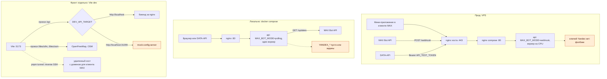

## 8. Ключевые сценарии

### 8.1. Запуск мини-приложения и авторизация

Логина нет: каждый запрос несет подписанные данные запуска MAX. Для проверки
без MAX есть тестовый токен одной служебной учетной записи.

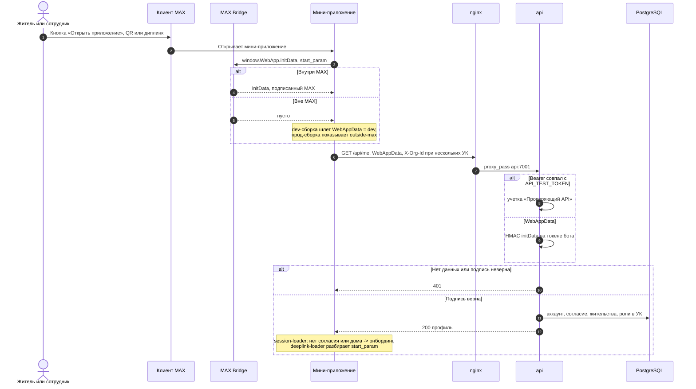

### 8.2. Апдейты бота: вебхук и опрос

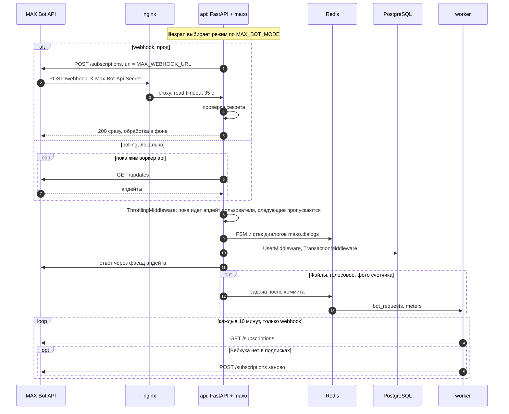

### 8.3. Транзакция, задачи и уведомления

Задача уходит в очередь только после коммита. Рассылка - цикл через очередь с
ограничителями платформы.

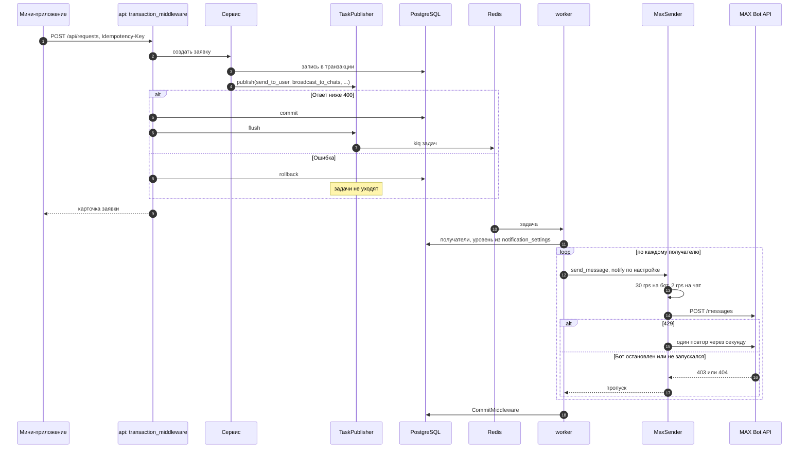

### 8.4. Подсказка категории заявки (LLM)

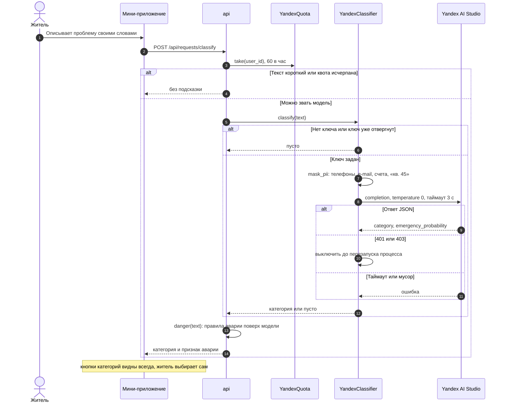

### 8.5. Показание счетчика по фото (OCR)

Два входа: форма мини-приложения (синхронно) и фото в диалог с ботом
(фоновая задача). Любой сбой сводится к пустому полю.

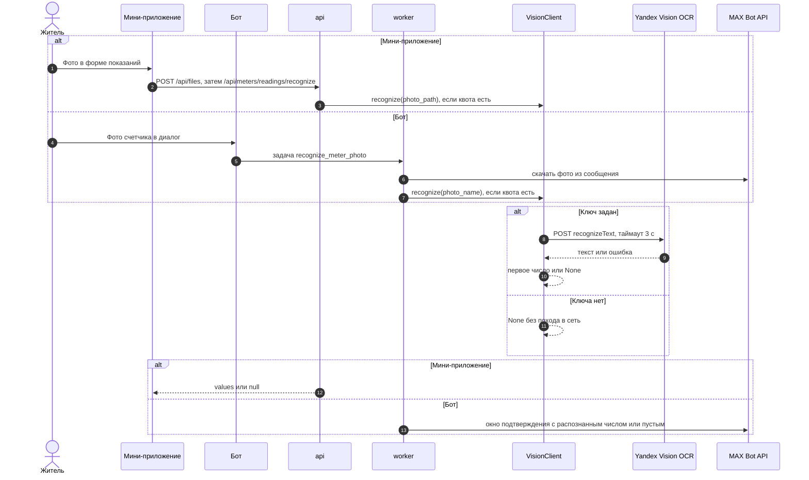

### 8.6. Голосовое в боте (SpeechKit)

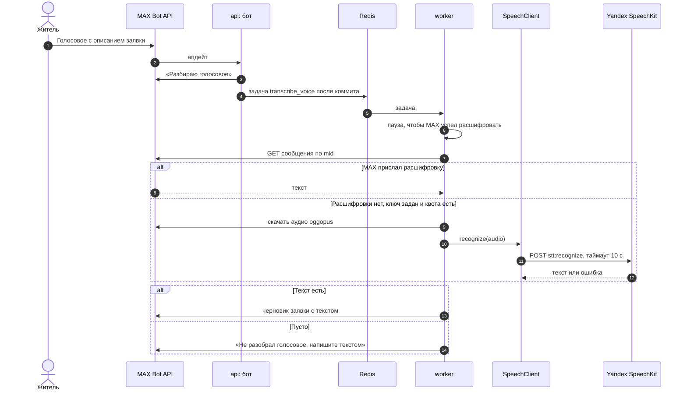

### 8.7. Загрузка и отдача файлов

Тег `` не умеет слать `WebAppData`, поэтому право на файл проверяется
при выдаче ссылки, а ссылка подписана HMAC и живет час.

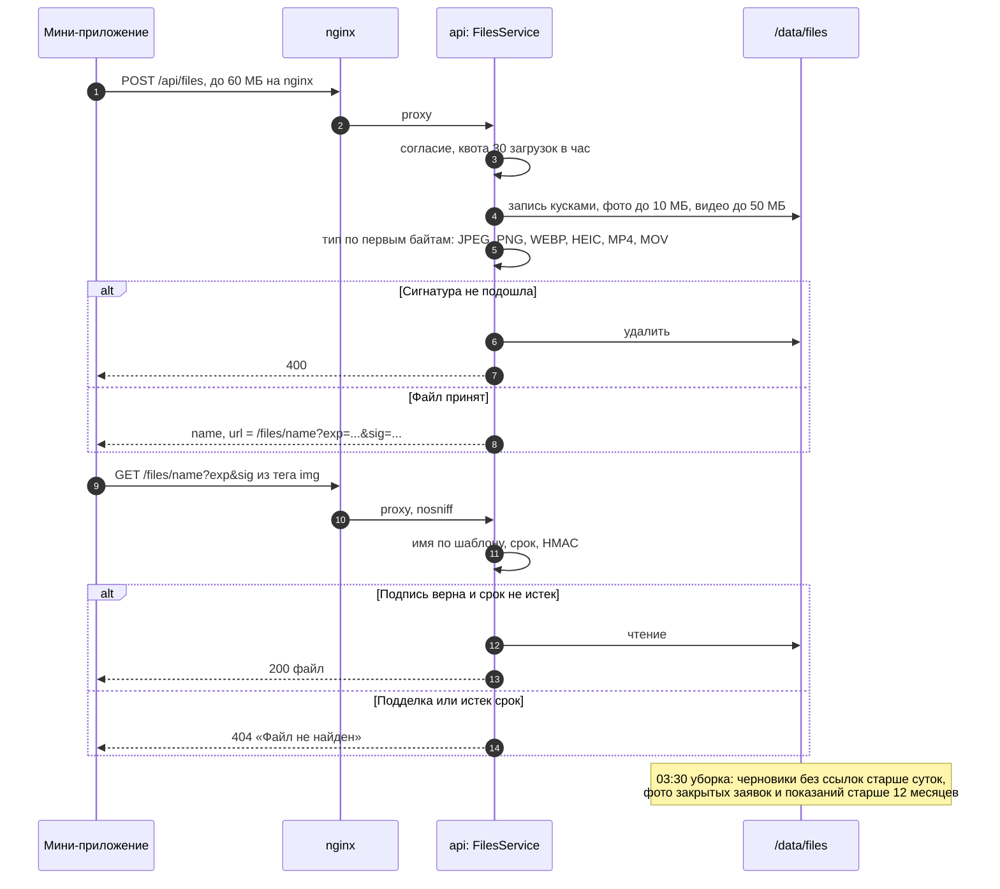

### 8.8. Карта: подложки и геокодер

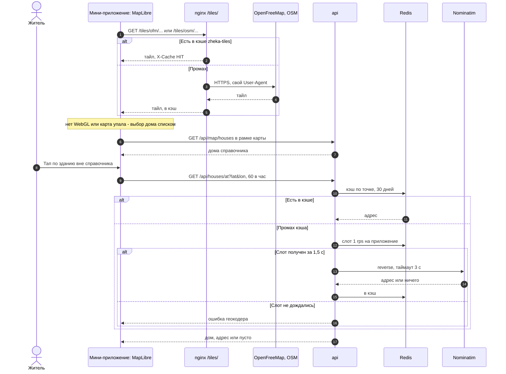

### 8.9. Демо-оплата квитанции

Реальной оплаты нет: ручка имитирует успех эквайринга, чтобы сценарий
квитанции проходился до конца.

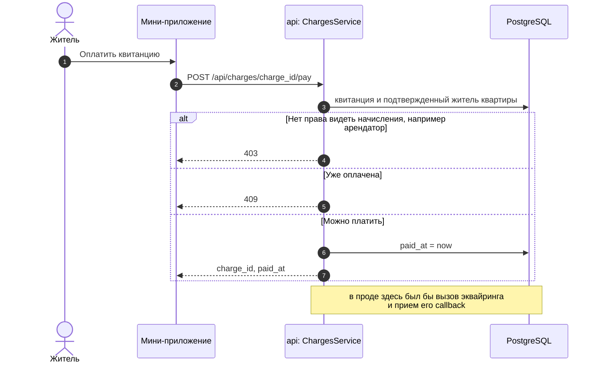

### 8.10. Деплой и мониторинг стенда

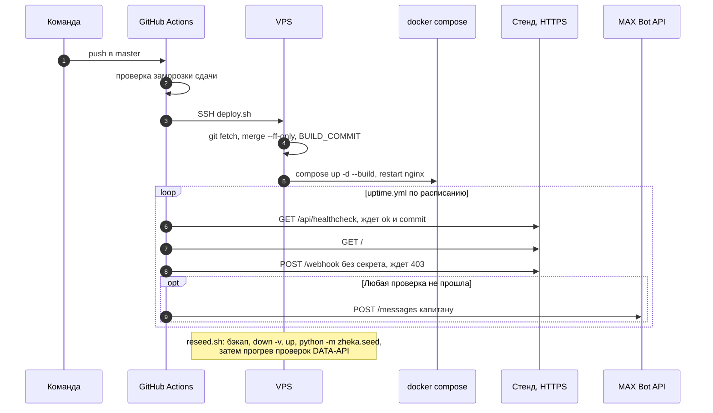
